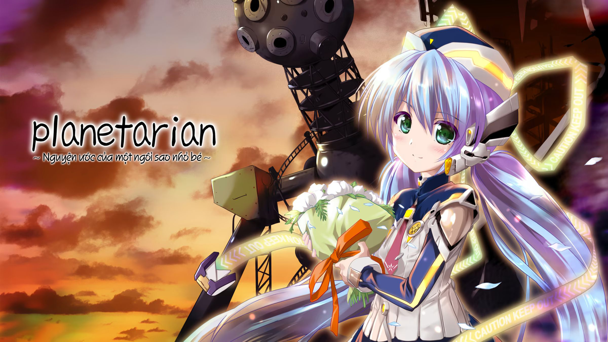

# Planetarian \~Nguyện ước của một ngôi sao nhỏ bé\~ Android Port

## Giới thiệu
"...Bạn nghĩ thế nào về cung thiên văn?"
 
"Bất kể lúc nào bạn cũng được ngắm nhìn những điều tuyệt vời, những tia sáng lấp lánh tưởng như vô tận."
 
"Vô vàn những vì sao trong vũ trụ này đang chờ bạn khám phá."
 
Phải rồi, đó hẳn là giọng nói hân hoan của một cô gái, dịu dàng và trong trẻo, khác hẳn với tòa nhà hoang phế, điêu tàn này.

Vào 16/7/2023 nước bạn Tung Của làm bản port android bằng cách code lại cả cái game, Nga có bản android từ lâu rồi, Pháp có bản switch và bản chạy trên web, Hàn có bản PSP mà chạy giả lập đc...    Chính vì vậy, xứ Đông Lào cũng phải port cái game siêu cute này lên android để sánh ngang với cường quốc năm châu :muscle:
_____________________________________________________________________________
### Hãy **ĐỌC KĨ** các nội dung dưới đây.

## Thông tin chung
- Phiên bản chơi được cả trên Android và Windows, song tiến trình chơi trên 2 nền tảng không tương thích với nhau.
- Đây là phiên bản port được "lấy cảm hứng" từ nhiều nguồn khác nhau: đĩa game JP, bản cũ của Sonako-Hako, bản HD của Hoshi, bản tiếng anh của Haeleth và insani
- Nghiêm cấm sử dụng bản port dưới bất kì hình thức thương mại nào.

## Link tải
[Terabox](https://terabox.com/s/1rJsqV8fVwSxYj3h4M0XR2g) / [Mega](https://mega.nz/file/1RAGgTSL#x9YjZYvw7Fi4pNbZf4giLXl0VhHFaqp4s38b-Oxka3k) / [MediaFire](https://www.mediafire.com/file/ehpmtjxf4d8e3yp/Planetarian_Viet+Hoa_Android.rar/file) / [Drive](https://drive.google.com/file/d/1pO_HG2X0EGUJBlJI6Ux4I71icg7gFVXP/view?usp=sharing)
 
Patch từ github (dành cho bạn nào thích vọc): [link]()

## Cách cài đặt
- Giải nén game vừa tải :penguin: (Đừng giải nén vào thẻ nhớ)
- Cài đặt app giả lập rlvm: [link](https://m.apkpure.com/vn/rlvm/is.xyz.rlvm)
- Mở app rlvm rồi tắt
- Sao chép và ghi đè file `DroidSansFallbackFull.ttf` vào thư mục `Android/data/is.xyz.rlvm/files` trong điện thoại.
- Mở app rlvm, đến thư mục game và chiến thôi.

Để chơi được trên windows, hãy cài đặt font Luudanmatcuoi.ttf

## Lưu ý
- Bấm bằng 2 ngón tay để mở bảng điều khiển.
- Thoát game bằng cách bấm "EXIT" hoặc "End the game" để các savegame của bạn lưu lại trong lần chơi tiếp theo 
__LÀM ƠN THOÁT GAME BẰNG CÁCH BẤM NÚT EXIT TRONG GAME__
 ( kể cả bạn save trong game rồi nhưng tiện tay tắt app rlvm thì quá trình chơi của bạn không được lưu ( Note: Đó là tính năng ) )
- Một số chỗ sẽ ở tiếng Anh / tiếng Nhật vì... t lười.
- Save game của rlvm không tương thích với bất cứ phiên bản nào khác.
  
Mình khuyến khích các bạn chơi bản HD đã được việt hoá bởi [Hoshi Visual Novel](http://www.hoshivsub.com/2018/08/planetarian-hd-edition.html) :penguin:

## Bug report
- Hỏi gì sang kênh youtube của mình mà hỏi https://www.youtube.com/channel/UCdyAb9TAX1qQ5R2-c91-x8g ( mặc dù kênh bị tha hoá r )
- Báo lỗi thì viết tâm thư qua tab Issues ý... chắc là t sẽ fix.

## Acknowledgments
Để có được bản port này, xin được gửi lời cảm ơn đến:
- [Haeleth](http://www.haeleth.net/) Một thiên tài, người khởi đầu cho tất cả
- [xyzz](https://github.com/xyzz/rlvm-android) Người viết trình giả lập
- [insani](http://insani.org/planetarian/index.html) Bản tiếng anh do fan dịch
- [Midishero vnsharing](https://www.youtube.com/user/midishero) Người dịch bản cũ
- [Hoshi Visual Novel](http://www.hoshivsub.com/) Nhóm port lên HD đồng thời tân trang 1 số chỗ.
- [yandere-chan](https://lop6a9.forumvi.com/t471-topic) người lưu bản cũ gần như tuyệt chủng

## Thừa giấy
...
